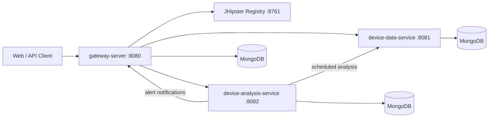

# Ignio-API

Backend for **Ignio**, an IoT monitoring platform built with Spring Boot microservices. The system collects sensor data from devices, runs regression-based analysis to detect anomalies, and raises alerts through a central API gateway with an Angular web UI.

## Architecture



## Services

| Service | Port | Description |
|---------|------|-------------|
| **gateway-server** | 8080 | API gateway, user management, billing, alert delivery, Angular UI |
| **device-data-service** | 8081 | Device registry and sensor data ingestion (temperature, CO, LP gas, particles) |
| **device-analysis-service** | 8082 | Scheduled regression analysis and alert generation |
| **model-trainer-service** | 8083 | Legacy ML training service (optional) |
| **JHipster Registry** | 8761 | Service discovery and centralized configuration |

Each service is a standalone Maven project generated with [JHipster 6.3.1](https://www.jhipster.tech/documentation-archive/v6.3.1).

## Features

- **Microservice architecture** with Eureka service discovery and Spring Cloud Config
- **MongoDB** persistence per service
- **Sensor data API** for device readings (temperature, CO ppm, LP gas ppm, particle ppm)
- **Regression analysis** on sensor trends to classify info, warning, and danger alert levels
- **Alert pipeline** from analysis service through the gateway (including email support)
- **JWT-based security** and user/account management via the gateway
- **Swagger UI** for API exploration
- **Docker Compose** for running the full stack locally
- **Prometheus metrics** and monitoring hooks

## Tech Stack

- Java 8, Spring Boot 2.1, Spring Cloud
- MongoDB
- Angular 8 (gateway UI)
- Maven, Webpack, Node.js (gateway frontend build)
- JHipster Registry
- Docker & Docker Compose

## Prerequisites

- JDK 8+
- Maven 3.x (or use the included `./mvnw` wrapper)
- Node.js & npm (required for `gateway-server` frontend)
- MongoDB (local or via Docker)
- [JHipster Registry](http://localhost:8761) running before any service starts

## Getting Started

### 1. Start infrastructure

Start the JHipster Registry (required by all services):

```bash
cd docker-compose
docker-compose -f jhipster-registry.yml up -d
```

Optionally start MongoDB instances via the full compose stack (see [Docker](#docker) below).

### 2. Run services locally

Start each service from its directory. Services must connect to the registry at `http://localhost:8761`.

**Gateway** (includes Angular dev server):

```bash
cd gateway-server
npm install
./mvnw          # terminal 1
npm start       # terminal 2
```

**Device Data Service:**

```bash
cd device-data-service
./mvnw
```

**Device Analysis Service:**

```bash
cd device-analysis-service
./mvnw
```

**Model Trainer Service** (optional):

```bash
cd model-trainer-service
./mvnw
```

On Windows, use `mvnw.cmd` instead of `./mvnw`.

### 3. Access the application

| Resource | URL |
|----------|-----|
| Gateway UI | http://localhost:8080 |
| Swagger UI | http://localhost:8080/swagger-ui.html |
| JHipster Registry | http://localhost:8761 |
| Registry credentials | `admin` / `admin` (default) |

Default user credentials are defined in each service's Liquibase/MongoDB seed data. Check the gateway migration files for the initial admin account.

## Docker

Build Docker images for each service, then launch the full stack:

```bash
cd docker-compose
docker-compose up -d
```

This starts the gateway, device-data-service, device-analysis-service, their MongoDB databases, and the JHipster Registry. See [docker-compose/README-DOCKER-COMPOSE.md](docker-compose/README-DOCKER-COMPOSE.md) for details.

## Building

Build a single service:

```bash
cd <service-directory>
./mvnw -Pprod clean verify
```

Production JAR:

```bash
java -jar target/*.jar
```

## API Documentation

- **Swagger** — http://localhost:8080/swagger-ui.html (aggregated gateway docs)
- **Postman Collection** — [Online docs](https://documenter.getpostman.com/view/2449187/RWTiwzb2)

## Project Structure

```
Ignio-API/
├── gateway-server/           # API gateway + Angular UI
├── device-data-service/      # Devices & sensor data
├── device-analysis-service/  # Regression analysis & alerts
├── model-trainer-service/    # ML model training (legacy)
├── docker-compose/           # Docker Compose & registry config
└── central-config/           # Sample Spring Cloud Config files
```

Each service follows the standard JHipster layout:

```
src/main/java/.../config/       # Spring configuration
src/main/java/.../domain/       # MongoDB entities
src/main/java/.../repository/   # Data access
src/main/java/.../service/      # Business logic
src/main/java/.../web/rest/     # REST controllers
src/main/resources/config/      # application.yml profiles
```

## Analysis Flow

1. **device-data-service** stores incoming sensor readings per device.
2. **device-analysis-service** runs on a schedule (~every 2 minutes), fetches recent sensor data, and computes linear regression slopes for each metric.
3. Slopes are weighted and mapped to alert levels (info, warning, danger).
4. When the threshold is met, an alert is persisted and forwarded to the **gateway-server** for notification (including email).

## Author

**George Vincent** — [g-vincent-tech](https://github.com/g-vincent-tech)
